# Multi-Branch Sales Analytics - README

## 📋 Deskripsi Proyek

Aplikasi web berbasis Flask untuk analisis penjualan multi-cabang restoran dengan fitur AI chatbot, visualisasi data interaktif, dan analisis COGS mendalam. Sistem ini dirancang khusus untuk jaringan restoran dengan multiple cabang yang membutuhkan analisis performa komprehensif.

## 🎯 Fitur Utama

### 1. Dashboard Overview
- **Ringkasan Metrik Global**: Total revenue, margin, COGS, transaksi
- **Visualisasi Interaktif**: Chart revenue per cabang, distribusi, dan performance matrix
- **Top Products Analysis**: Produk terlaris berdasarkan revenue
- **Branch Ranking**: Ranking performa cabang dengan status indikator

### 2. Branch Comparison
- **Komparasi Revenue**: Perbandingan pendapatan antar cabang
- **Efficiency Analysis**: Analisis efisiensi revenue per transaksi
- **Margin vs COGS Matrix**: Scatter plot performa cabang
- **Gap Analysis**: Identifikasi gap performa antar cabang
- **Strategic Recommendations**: Rekomendasi bisnis berbasis data

### 3. Product Analysis (Branch-First Approach)
- **Branch-Specific Menu**: Setiap cabang memiliki menu unik
- **Top Performers per Branch**: Top products spesifik per cabang
- **Product Detail Analysis**: Analisis mendalam per produk per cabang
- **Revenue & Quantity Focus**: Metrik utama untuk analisis produk
- **Cross-Branch Insights**: Identifikasi produk konsisten

### 4. Sales by Time
- **Branch Trends Over Time**: Tren penjualan semua cabang
- **Hover-Optimized Charts**: Tooltip per-trace untuk clarity
- **Multi-Branch Comparison**: Visualisasi semua cabang dalam satu chart

### 5. COGS Analysis (Branch-First)
- **COGS per Product per Branch**: Analisis COGS spesifik cabang
- **Branch Efficiency Ranking**: Ranking efisiensi COGS per cabang
- **Product Selection Flow**: Pilih cabang → pilih produk
- **COGS Optimization Insights**: Rekomendasi optimasi berdasarkan data
- **No Cross-Branch Aggregation**: Hindari agregasi yang tidak valid

### 6. AI Assistant (Groq-powered)
- **Conversational Analysis**: Chat natural dengan AI analyst
- **Context-Aware Responses**: AI memahami konteks data multi-branch
- **Suggested Questions**: Template pertanyaan analitis
- **Real-time Insights**: Generate insights on-demand

## 🛠 Teknologi Stack

### Backend
- **Flask 3.0.0**: Web framework
- **Pandas 2.1.4**: Data manipulation
- **NumPy 1.26.4**: Numerical computing
- **OpenPyXL 3.1.2**: Excel file processing
- **Groq 0.4.1**: AI chatbot integration

### Frontend
- **Bootstrap 5.3.0**: UI framework
- **Plotly.js 2.26.0**: Interactive charts
- **Font Awesome 6.4.0**: Icons
- **Custom CSS**: Power BI-inspired design

### Data Processing
- **Multi-branch data loader**: Handle berbagai format Excel
- **Safe calculations**: Error handling untuk operasi matematika
- **Branch-first architecture**: Struktur data per cabang

## 📁 Struktur Direktori

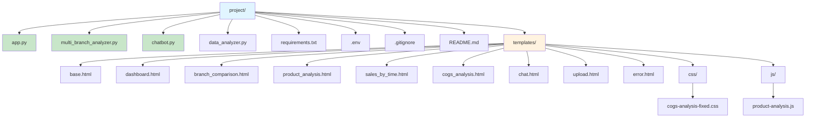
```mermaid
graph TD
    A[project/] --> B[app.py]
    A --> C[multi_branch_analyzer.py]
    A --> D[chatbot.py]
    A --> E[data_analyzer.py]
    A --> F[requirements.txt]
    A --> G[.env]
    A --> H[.gitignore]
    A --> I[README.md]
    A --> J[templates/]
    
    J --> K[base.html]
    J --> L[dashboard.html]
    J --> M[branch_comparison.html]
    J --> N[product_analysis.html]
    J --> O[sales_by_time.html]
    J --> P[cogs_analysis.html]
    J --> Q[chat.html]
    J --> R[upload.html]
    J --> S[error.html]
    J --> T[css/]
    J --> U[js/]
    
    T --> V[cogs-analysis-fixed.css]
    U --> W[product-analysis.js]
    
    style A fill:#e1f5ff
    style J fill:#fff3e0
    style B fill:#c8e6c9
    style C fill:#c8e6c9
    style D fill:#c8e6c9
```

## 🚀 Instalasi

### Prerequisites
- Python 3.8+
- pip package manager
- Virtual environment (recommended)

### Diagram Alur Instalasi


```mermaid
graph LR
    A[Start] --> B[Clone Repository]
    B --> C[Create Virtual Environment]
    C --> D[Activate venv]
    D --> E[Install Dependencies]
    E --> F[Setup .env File]
    F --> G[Verify Setup]
    G --> H[Run Application]
    H --> I[Access http://localhost:5000]
    
    style A fill:#90EE90
    style I fill:#90EE90
    style F fill:#FFD700
```

### Langkah Instalasi

1. **Clone Repository**
```bash
git clone <repository-url>
cd <project-folder>
```

2. **Buat Virtual Environment**
```bash
python -m venv venv

# Windows
venv\Scripts\activate

# Linux/Mac
source venv/bin/activate
```

3. **Install Dependencies**
```bash
pip install -r requirements.txt
```

4. **Setup Environment Variables**
Buat file `.env` di root directory:
```env
GROQ_API_KEY=your_groq_api_key_here
SECRET_KEY=your_flask_secret_key_here
```

5. **Verifikasi Setup**
```bash
python app.py
```

Aplikasi akan berjalan di `http://localhost:5000`

## 📊 Arsitektur Sistem

### System Architecture Overview

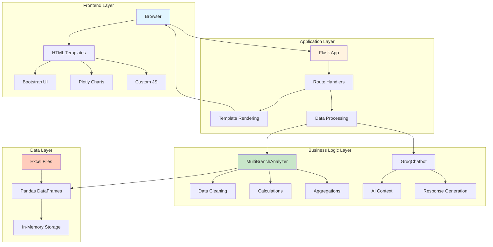
```mermaid
graph TB
    subgraph "Frontend Layer"
        A[Browser] --> B[HTML Templates]
        B --> C[Bootstrap UI]
        B --> D[Plotly Charts]
        B --> E[Custom JS]
    end
    
    subgraph "Application Layer"
        F[Flask App] --> G[Route Handlers]
        G --> H[Template Rendering]
        G --> I[Data Processing]
    end
    
    subgraph "Business Logic Layer"
        J[MultiBranchAnalyzer] --> K[Data Cleaning]
        J --> L[Calculations]
        J --> M[Aggregations]
        N[GroqChatbot] --> O[AI Context]
        N --> P[Response Generation]
    end
    
    subgraph "Data Layer"
        Q[Excel Files] --> R[Pandas DataFrames]
        R --> S[In-Memory Storage]
    end
    
    A --> F
    I --> J
    I --> N
    J --> R
    H --> A
    
    style A fill:#e1f5ff
    style F fill:#fff3e0
    style J fill:#c8e6c9
    style Q fill:#ffccbc
```

### Data Flow Architecture

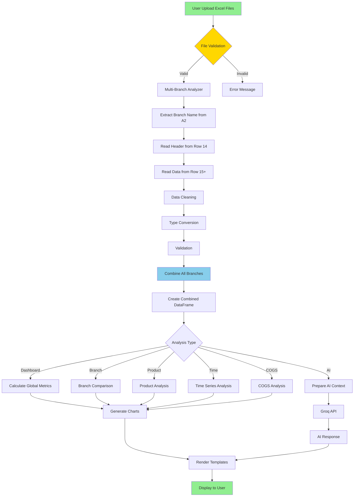
```mermaid
flowchart TD
    A[User Upload Excel Files] --> B{File Validation}
    B -->|Valid| C[Multi-Branch Analyzer]
    B -->|Invalid| D[Error Message]
    
    C --> E[Extract Branch Name from A2]
    E --> F[Read Header from Row 14]
    F --> G[Read Data from Row 15+]
    
    G --> H[Data Cleaning]
    H --> I[Type Conversion]
    I --> J[Validation]
    
    J --> K[Combine All Branches]
    K --> L[Create Combined DataFrame]
    
    L --> M{Analysis Type}
    
    M -->|Dashboard| N[Calculate Global Metrics]
    M -->|Branch| O[Branch Comparison]
    M -->|Product| P[Product Analysis]
    M -->|Time| Q[Time Series Analysis]
    M -->|COGS| R[COGS Analysis]
    M -->|AI| S[Prepare AI Context]
    
    N --> T[Generate Charts]
    O --> T
    P --> T
    Q --> T
    R --> T
    
    S --> U[Groq API]
    U --> V[AI Response]
    
    T --> W[Render Templates]
    V --> W
    W --> X[Display to User]
    
    style A fill:#90EE90
    style B fill:#FFD700
    style K fill:#87CEEB
    style X fill:#90EE90
```

### Component Interaction Diagram

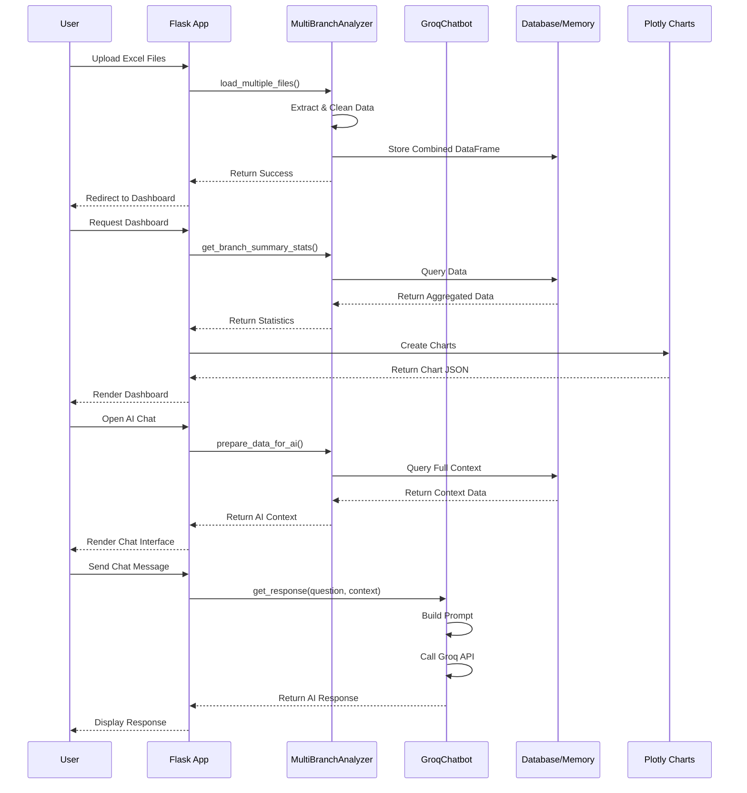
```mermaid
sequenceDiagram
    participant U as User
    participant F as Flask App
    participant M as MultiBranchAnalyzer
    participant C as GroqChatbot
    participant D as Database/Memory
    participant P as Plotly Charts
    
    U->>F: Upload Excel Files
    F->>M: load_multiple_files()
    M->>M: Extract & Clean Data
    M->>D: Store Combined DataFrame
    M-->>F: Return Success
    F-->>U: Redirect to Dashboard
    
    U->>F: Request Dashboard
    F->>M: get_branch_summary_stats()
    M->>D: Query Data
    D-->>M: Return Aggregated Data
    M-->>F: Return Statistics
    F->>P: Create Charts
    P-->>F: Return Chart JSON
    F-->>U: Render Dashboard
    
    U->>F: Open AI Chat
    F->>M: prepare_data_for_ai()
    M->>D: Query Full Context
    D-->>M: Return Context Data
    M-->>F: Return AI Context
    F-->>U: Render Chat Interface
    
    U->>F: Send Chat Message
    F->>C: get_response(question, context)
    C->>C: Build Prompt
    C->>C: Call Groq API
    C-->>F: Return AI Response
    F-->>U: Display Response
```

## 🔄 Data Processing Flow

### Excel Data Structure

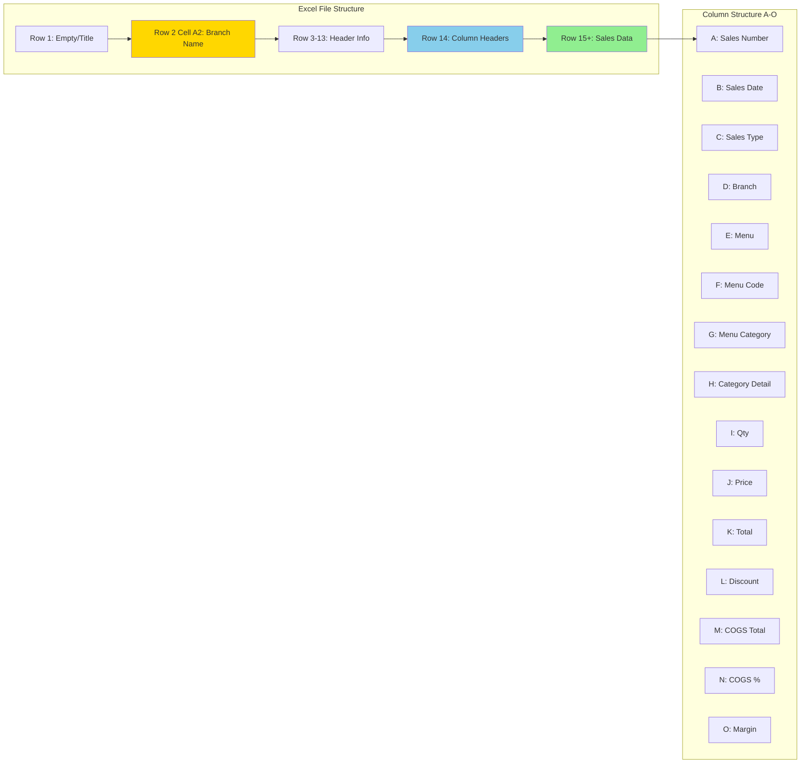
```mermaid
graph LR
    subgraph "Excel File Structure"
        A[Row 1: Empty/Title] --> B[Row 2 Cell A2: Branch Name]
        B --> C[Row 3-13: Header Info]
        C --> D[Row 14: Column Headers]
        D --> E[Row 15+: Sales Data]
    end
    
    subgraph "Column Structure A-O"
        F[A: Sales Number]
        G[B: Sales Date]
        H[C: Sales Type]
        I[D: Branch]
        J[E: Menu]
        K[F: Menu Code]
        L[G: Menu Category]
        M[H: Category Detail]
        N[I: Qty]
        O[J: Price]
        P[K: Total]
        Q[L: Discount]
        R[M: COGS Total]
        S[N: COGS %]
        T[O: Margin]
    end
    
    E --> F
    
    style B fill:#FFD700
    style D fill:#87CEEB
    style E fill:#90EE90
```

### Data Transformation Pipeline


```mermaid
flowchart LR
    A[Raw Excel] --> B[Extract Branch A2]
    B --> C[Read Headers Row 14]
    C --> D[Read Data Row 15+]
    
    D --> E{Data Validation}
    E -->|Pass| F[Clean Data]
    E -->|Fail| G[Log Error & Skip]
    
    F --> H[Convert Types]
    H --> I[Handle Missing Values]
    I --> J[Calculate Derived Fields]
    
    J --> K[Add Time Features]
    K --> L[Add Branch Column]
    L --> M[Validated DataFrame]
    
    M --> N[Append to Combined]
    N --> O[Final Dataset]
    
    style A fill:#ffccbc
    style E fill:#FFD700
    style M fill:#90EE90
    style O fill:#87CEEB
```

## 🎨 User Interface Flow

### Main Navigation Flow

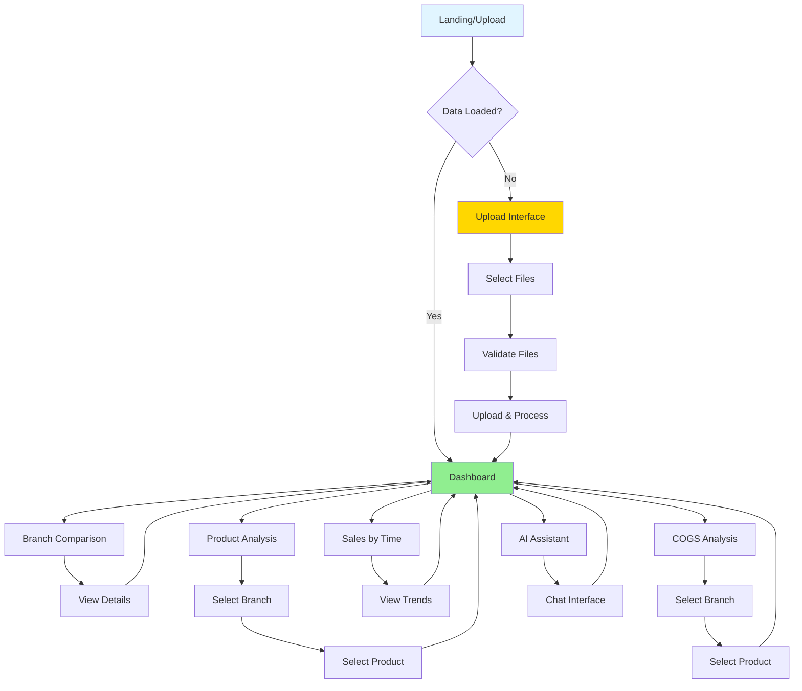
```mermaid
graph TD
    A[Landing/Upload] --> B{Data Loaded?}
    B -->|No| C[Upload Interface]
    B -->|Yes| D[Dashboard]
    
    C --> E[Select Files]
    E --> F[Validate Files]
    F --> G[Upload & Process]
    G --> D
    
    D --> H[Branch Comparison]
    D --> I[Product Analysis]
    D --> J[Sales by Time]
    D --> K[COGS Analysis]
    D --> L[AI Assistant]
    
    H --> M[View Details]
    I --> N[Select Branch]
    N --> O[Select Product]
    J --> P[View Trends]
    K --> Q[Select Branch]
    Q --> R[Select Product]
    L --> S[Chat Interface]
    
    M --> D
    O --> D
    P --> D
    R --> D
    S --> D
    
    style A fill:#e1f5ff
    style D fill:#90EE90
    style C fill:#FFD700
```

### Product Analysis Workflow (Branch-First)

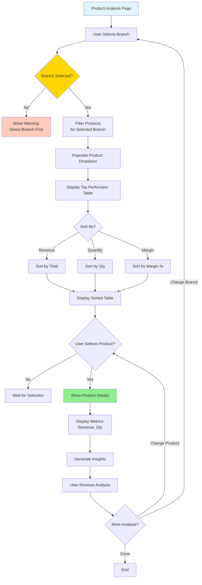
```mermaid
flowchart TD
    A[Product Analysis Page] --> B[User Selects Branch]
    
    B --> C{Branch Selected?}
    C -->|No| D[Show Warning:<br/>Select Branch First]
    C -->|Yes| E[Filter Products<br/>for Selected Branch]
    
    E --> F[Populate Product Dropdown]
    F --> G[Display Top Performers Table]
    
    G --> H{Sort By?}
    H -->|Revenue| I[Sort by Total]
    H -->|Quantity| J[Sort by Qty]
    H -->|Margin| K[Sort by Margin %]
    
    I --> L[Display Sorted Table]
    J --> L
    K --> L
    
    L --> M{User Selects Product?}
    M -->|No| N[Wait for Selection]
    M -->|Yes| O[Show Product Details]
    
    O --> P[Display Metrics:<br/>Revenue, Qty]
    P --> Q[Generate Insights]
    
    Q --> R[User Reviews Analysis]
    R --> S{More Analysis?}
    S -->|Change Branch| B
    S -->|Change Product| M
    S -->|Done| T[End]
    
    style A fill:#e1f5ff
    style C fill:#FFD700
    style D fill:#ffccbc
    style O fill:#90EE90
```

### COGS Analysis Workflow (Branch-First)

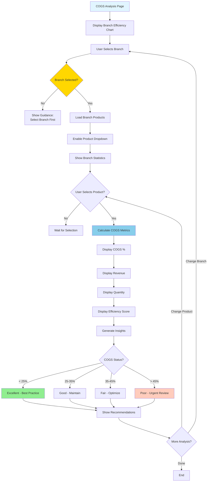
```mermaid
flowchart TD
    A[COGS Analysis Page] --> B[Display Branch Efficiency Chart]
    
    B --> C[User Selects Branch]
    C --> D{Branch Selected?}
    
    D -->|No| E[Show Guidance:<br/>Select Branch First]
    D -->|Yes| F[Load Branch Products]
    
    F --> G[Enable Product Dropdown]
    G --> H[Show Branch Statistics]
    
    H --> I{User Selects Product?}
    I -->|No| J[Wait for Selection]
    I -->|Yes| K[Calculate COGS Metrics]
    
    K --> L[Display COGS %]
    L --> M[Display Revenue]
    M --> N[Display Quantity]
    N --> O[Display Efficiency Score]
    
    O --> P[Generate Insights]
    P --> Q{COGS Status?}
    
    Q -->|< 25%| R[Excellent - Best Practice]
    Q -->|25-35%| S[Good - Maintain]
    Q -->|35-45%| T[Fair - Optimize]
    Q -->|> 45%| U[Poor - Urgent Review]
    
    R --> V[Show Recommendations]
    S --> V
    T --> V
    U --> V
    
    V --> W{More Analysis?}
    W -->|Change Branch| C
    W -->|Change Product| I
    W -->|Done| X[End]
    
    style A fill:#e1f5ff
    style D fill:#FFD700
    style K fill:#87CEEB
    style R fill:#90EE90
    style U fill:#ffccbc
```

## 💬 AI Chatbot Flow

### Chatbot Interaction Diagram

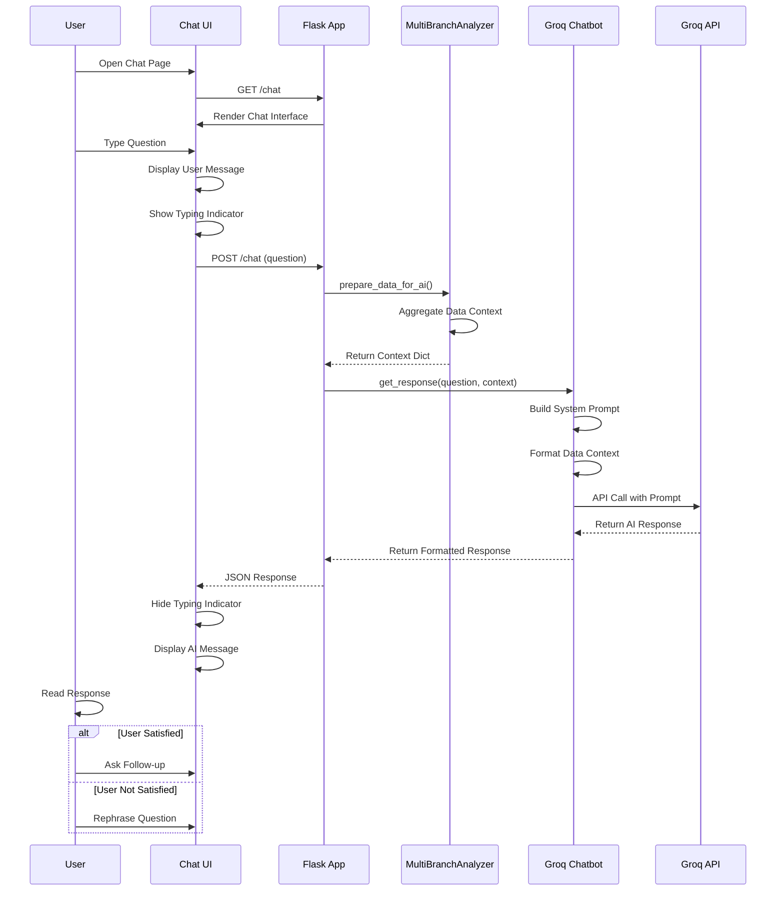
```mermaid
sequenceDiagram
    participant U as User
    participant UI as Chat UI
    participant F as Flask App
    participant M as MultiBranchAnalyzer
    participant C as Groq Chatbot
    participant G as Groq API
    
    U->>UI: Open Chat Page
    UI->>F: GET /chat
    F->>UI: Render Chat Interface
    
    U->>UI: Type Question
    UI->>UI: Display User Message
    UI->>UI: Show Typing Indicator
    
    UI->>F: POST /chat (question)
    F->>M: prepare_data_for_ai()
    M->>M: Aggregate Data Context
    M-->>F: Return Context Dict
    
    F->>C: get_response(question, context)
    C->>C: Build System Prompt
    C->>C: Format Data Context
    C->>G: API Call with Prompt
    
    G-->>C: Return AI Response
    C-->>F: Return Formatted Response
    F-->>UI: JSON Response
    
    UI->>UI: Hide Typing Indicator
    UI->>UI: Display AI Message
    U->>U: Read Response
    
    alt User Satisfied
        U->>UI: Ask Follow-up
    else User Not Satisfied
        U->>UI: Rephrase Question
    end
```

### AI Context Preparation Flow

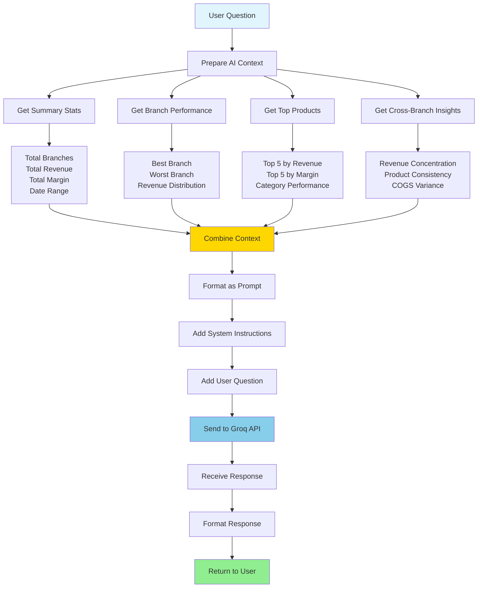
```mermaid
flowchart TD
    A[User Question] --> B[Prepare AI Context]
    
    B --> C[Get Summary Stats]
    C --> D[Total Branches<br/>Total Revenue<br/>Total Margin<br/>Date Range]
    
    B --> E[Get Branch Performance]
    E --> F[Best Branch<br/>Worst Branch<br/>Revenue Distribution]
    
    B --> G[Get Top Products]
    G --> H[Top 5 by Revenue<br/>Top 5 by Margin<br/>Category Performance]
    
    B --> I[Get Cross-Branch Insights]
    I --> J[Revenue Concentration<br/>Product Consistency<br/>COGS Variance]
    
    D --> K[Combine Context]
    F --> K
    H --> K
    J --> K
    
    K --> L[Format as Prompt]
    L --> M[Add System Instructions]
    M --> N[Add User Question]
    
    N --> O[Send to Groq API]
    O --> P[Receive Response]
    P --> Q[Format Response]
    Q --> R[Return to User]
    
    style A fill:#e1f5ff
    style K fill:#FFD700
    style O fill:#87CEEB
    style R fill:#90EE90
```

## 📈 Chart Generation Flow

### Chart Creation Pipeline

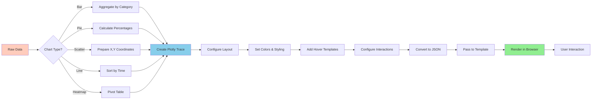
```mermaid
flowchart LR
    A[Raw Data] --> B{Chart Type?}
    
    B -->|Bar| C[Aggregate by Category]
    B -->|Pie| D[Calculate Percentages]
    B -->|Scatter| E[Prepare X,Y Coordinates]
    B -->|Line| F[Sort by Time]
    B -->|Heatmap| G[Pivot Table]
    
    C --> H[Create Plotly Trace]
    D --> H
    E --> H
    F --> H
    G --> H
    
    H --> I[Configure Layout]
    I --> J[Set Colors & Styling]
    J --> K[Add Hover Templates]
    K --> L[Configure Interactions]
    
    L --> M[Convert to JSON]
    M --> N[Pass to Template]
    N --> O[Render in Browser]
    O --> P[User Interaction]
    
    style A fill:#ffccbc
    style H fill:#87CEEB
    style O fill:#90EE90
```

### Dashboard Chart Generation

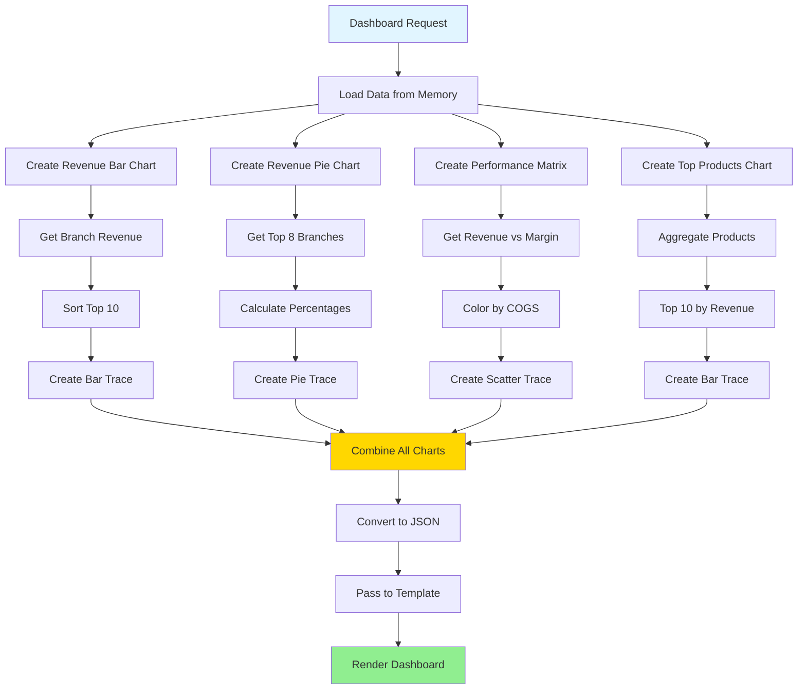
```mermaid
graph TD
    A[Dashboard Request] --> B[Load Data from Memory]
    
    B --> C[Create Revenue Bar Chart]
    C --> C1[Get Branch Revenue]
    C1 --> C2[Sort Top 10]
    C2 --> C3[Create Bar Trace]
    
    B --> D[Create Revenue Pie Chart]
    D --> D1[Get Top 8 Branches]
    D1 --> D2[Calculate Percentages]
    D2 --> D3[Create Pie Trace]
    
    B --> E[Create Performance Matrix]
    E --> E1[Get Revenue vs Margin]
    E1 --> E2[Color by COGS]
    E2 --> E3[Create Scatter Trace]
    
    B --> F[Create Top Products Chart]
    F --> F1[Aggregate Products]
    F1 --> F2[Top 10 by Revenue]
    F2 --> F3[Create Bar Trace]
    
    C3 --> G[Combine All Charts]
    D3 --> G
    E3 --> G
    F3 --> G
    
    G --> H[Convert to JSON]
    H --> I[Pass to Template]
    I --> J[Render Dashboard]
    
    style A fill:#e1f5ff
    style G fill:#FFD700
    style J fill:#90EE90
```

## 🔐 Security & Error Handling

### Security Flow

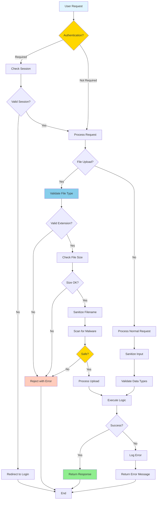
```mermaid
flowchart TD
    A[User Request] --> B{Authentication?}
    B -->|Required| C[Check Session]
    B -->|Not Required| D[Process Request]
    
    C --> E{Valid Session?}
    E -->|No| F[Redirect to Login]
    E -->|Yes| D
    
    D --> G{File Upload?}
    G -->|Yes| H[Validate File Type]
    G -->|No| K[Process Normal Request]
    
    H --> I{Valid Extension?}
    I -->|No| J[Reject with Error]
    I -->|Yes| L[Check File Size]
    
    L --> M{Size OK?}
    M -->|No| J
    M -->|Yes| N[Sanitize Filename]
    
    N --> O[Scan for Malware]
    O --> P{Safe?}
    P -->|No| J
    P -->|Yes| Q[Process Upload]
    
    K --> R[Sanitize Input]
    R --> S[Validate Data Types]
    S --> T[Execute Logic]
    
    Q --> T
    T --> U{Success?}
    U -->|Yes| V[Return Response]
    U -->|No| W[Log Error]
    W --> X[Return Error Message]
    
    F --> Y[End]
    J --> Y
    V --> Y
    X --> Y
    
    style A fill:#e1f5ff
    style B fill:#FFD700
    style H fill:#87CEEB
    style P fill:#FFD700
    style J fill:#ffccbc
    style V fill:#90EE90
```

### Error Handling Flow

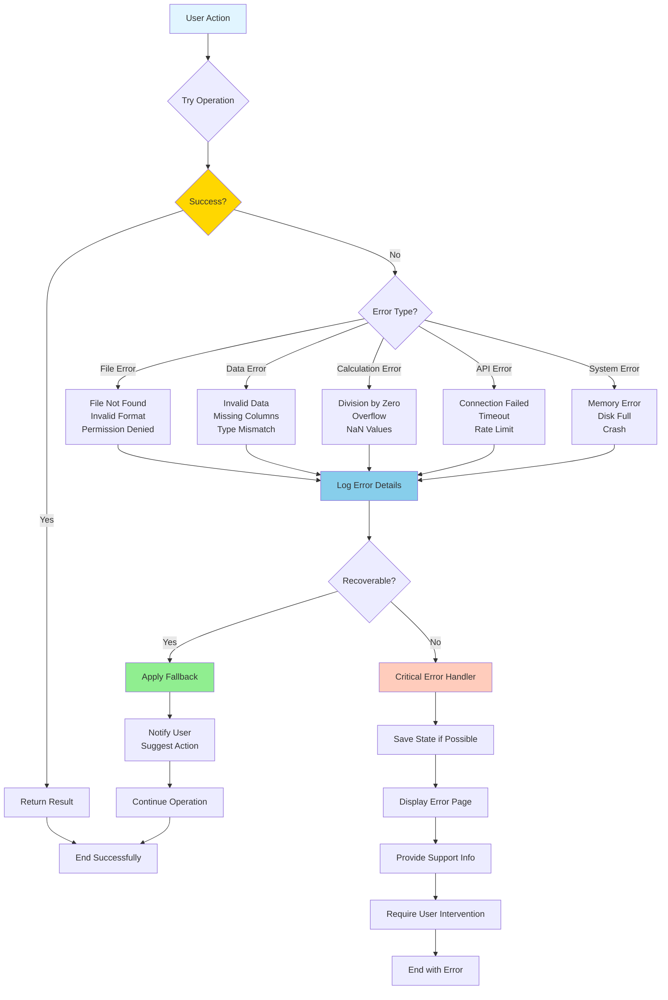
```mermaid
flowchart TD
    A[User Action] --> B{Try Operation}
    
    B --> C{Success?}
    C -->|Yes| D[Return Result]
    C -->|No| E{Error Type?}
    
    E -->|File Error| F[File Not Found<br/>Invalid Format<br/>Permission Denied]
    E -->|Data Error| G[Invalid Data<br/>Missing Columns<br/>Type Mismatch]
    E -->|Calculation Error| H[Division by Zero<br/>Overflow<br/>NaN Values]
    E -->|API Error| I[Connection Failed<br/>Timeout<br/>Rate Limit]
    E -->|System Error| J[Memory Error<br/>Disk Full<br/>Crash]
    
    F --> K[Log Error Details]
    G --> K
    H --> K
    I --> K
    J --> K
    
    K --> L{Recoverable?}
    
    L -->|Yes| M[Apply Fallback]
    M --> N[Notify User<br/>Suggest Action]
    
    L -->|No| O[Critical Error Handler]
    O --> P[Save State if Possible]
    P --> Q[Display Error Page]
    Q --> R[Provide Support Info]
    
    N --> S[Continue Operation]
    R --> T[Require User Intervention]
    
    D --> U[End Successfully]
    S --> U
    T --> V[End with Error]
    
    style A fill:#e1f5ff
    style C fill:#FFD700
    style K fill:#87CEEB
    style M fill:#90EE90
    style O fill:#ffccbc
```

## 📤 Upload & Processing Flow

### Complete Upload Workflow

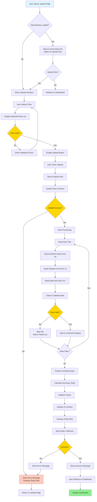
```mermaid
flowchart TD
    A[User Opens Upload Page] --> B{Data Already Loaded?}
    B -->|Yes| C[Show Current Data Info<br/>Option to Upload New]
    B -->|No| D[Show Upload Interface]
    
    C --> E{Upload New?}
    E -->|No| F[Redirect to Dashboard]
    E -->|Yes| D
    
    D --> G[User Selects Files]
    G --> H[Display Selected Files List]
    H --> I{Files Valid?}
    
    I -->|No| J[Show Validation Errors]
    J --> G
    
    I -->|Yes| K[Enable Upload Button]
    K --> L[User Clicks Upload]
    
    L --> M[Show Progress Bar]
    M --> N[Upload Files to Server]
    
    N --> O{Upload Success?}
    O -->|No| P[Show Error Message<br/>Cleanup Temp Files]
    O -->|Yes| Q[Start Processing]
    
    Q --> R[Read Each File]
    R --> S[Extract Branch Name from A2]
    S --> T[Read Headers from Row 14]
    T --> U[Read Data from Row 15+]
    
    U --> V[Clean & Validate Data]
    V --> W{Data Valid?}
    
    W -->|No| X[Skip File<br/>Add to Failed List]
    W -->|Yes| Y[Add to Combined Dataset]
    
    X --> Z{More Files?}
    Y --> Z
    
    Z -->|Yes| R
    Z -->|No| AA[Finalize Combined Data]
    
    AA --> AB[Calculate Summary Stats]
    AB --> AC[Initialize Charts]
    AC --> AD[Initialize AI Context]
    
    AD --> AE[Cleanup Temp Files]
    AE --> AF[Store Data in Memory]
    
    AF --> AG{Success?}
    AG -->|Yes| AH[Show Success Message]
    AG -->|No| AI[Show Error Message]
    
    AH --> AJ[Auto Redirect to Dashboard]
    AI --> P
    
    P --> AK[Return to Upload Page]
    AJ --> AL[Display Dashboard]
    
    style A fill:#e1f5ff
    style I fill:#FFD700
    style O fill:#FFD700
    style W fill:#FFD700
    style AG fill:#FFD700
    style AL fill:#90EE90
    style P fill:#ffccbc
```

## 🎯 Use Case Diagrams

### System Use Cases

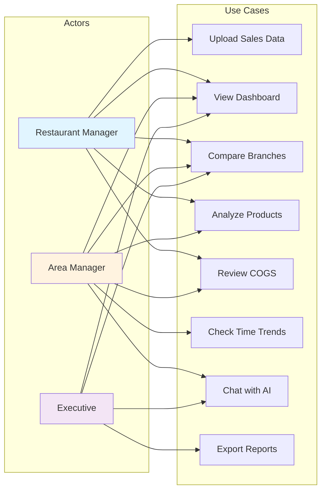
```mermaid
flowchart LR
    subgraph Actors
        U[Restaurant Manager]
        A[Area Manager]
        E[Executive]
    end
    
    subgraph Use Cases
        UC1[Upload Sales Data]
        UC2[View Dashboard]
        UC3[Compare Branches]
        UC4[Analyze Products]
        UC5[Review COGS]
        UC6[Check Time Trends]
        UC7[Chat with AI]
        UC8[Export Reports]
    end
    
    U --> UC1
    U --> UC2
    U --> UC3
    U --> UC4
    U --> UC5
    
    A --> UC2
    A --> UC3
    A --> UC4
    A --> UC5
    A --> UC6
    A --> UC7
    
    E --> UC2
    E --> UC3
    E --> UC7
    E --> UC8
    
    style U fill:#e1f5ff
    style A fill:#fff3e0
    style E fill:#f3e5f5
```

### Branch Manager Use Case Flow

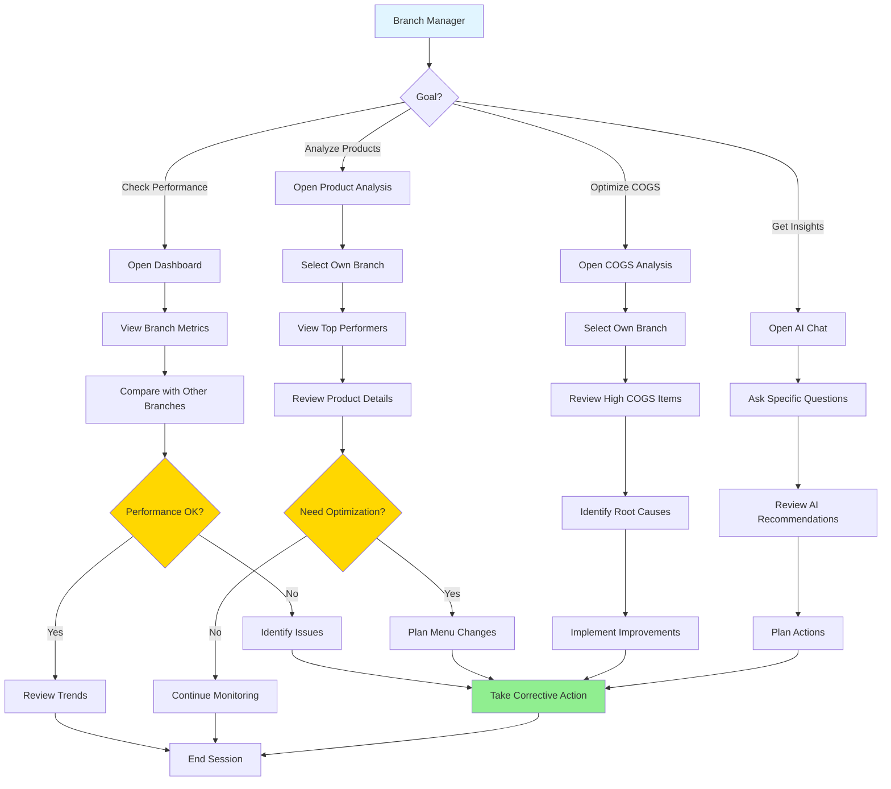
```mermaid
flowchart TD
    A[Branch Manager] --> B{Goal?}
    
    B -->|Check Performance| C[Open Dashboard]
    C --> D[View Branch Metrics]
    D --> E[Compare with Other Branches]
    E --> F{Performance OK?}
    F -->|Yes| G[Review Trends]
    F -->|No| H[Identify Issues]
    
    B -->|Analyze Products| I[Open Product Analysis]
    I --> J[Select Own Branch]
    J --> K[View Top Performers]
    K --> L[Review Product Details]
    L --> M{Need Optimization?}
    M -->|Yes| N[Plan Menu Changes]
    M -->|No| O[Continue Monitoring]
    
    B -->|Optimize COGS| P[Open COGS Analysis]
    P --> Q[Select Own Branch]
    Q --> R[Review High COGS Items]
    R --> S[Identify Root Causes]
    S --> T[Implement Improvements]
    
    B -->|Get Insights| U[Open AI Chat]
    U --> V[Ask Specific Questions]
    V --> W[Review AI Recommendations]
    W --> X[Plan Actions]
    
    H --> Y[Take Corrective Action]
    N --> Y
    T --> Y
    X --> Y
    
    G --> Z[End Session]
    O --> Z
    Y --> Z
    
    style A fill:#e1f5ff
    style F fill:#FFD700
    style M fill:#FFD700
    style Y fill:#90EE90
```

## 🔄 State Diagrams

### Application State Machine

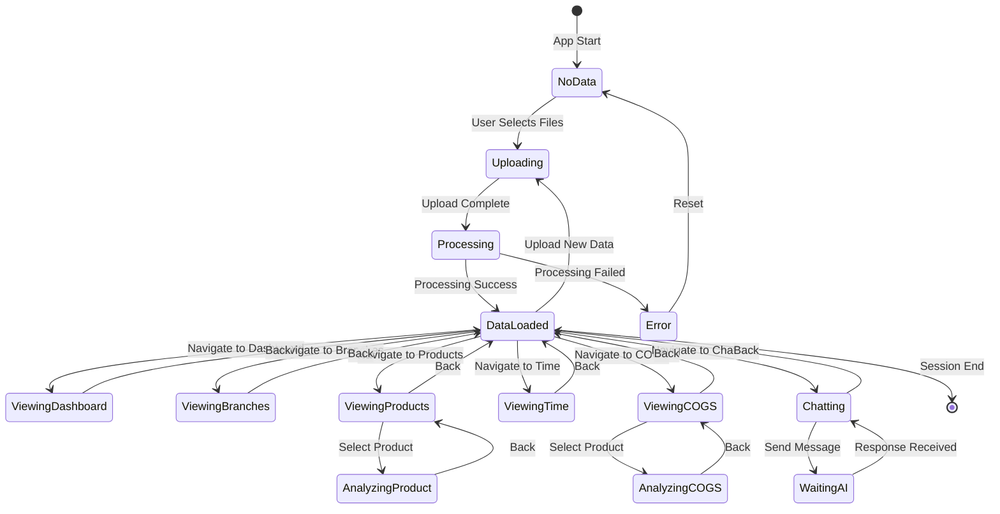
```mermaid
stateDiagram-v2
    [*] --> NoData: App Start
    
    NoData --> Uploading: User Selects Files
    Uploading --> Processing: Upload Complete
    Processing --> DataLoaded: Processing Success
    Processing --> Error: Processing Failed
    Error --> NoData: Reset
    
    DataLoaded --> ViewingDashboard: Navigate to Dashboard
    DataLoaded --> ViewingBranches: Navigate to Branches
    DataLoaded --> ViewingProducts: Navigate to Products
    DataLoaded --> ViewingTime: Navigate to Time
    DataLoaded --> ViewingCOGS: Navigate to COGS
    DataLoaded --> Chatting: Navigate to Chat
    
    ViewingDashboard --> DataLoaded: Back
    ViewingBranches --> DataLoaded: Back
    ViewingProducts --> DataLoaded: Back
    ViewingTime --> DataLoaded: Back
    ViewingCOGS --> DataLoaded: Back
    Chatting --> DataLoaded: Back
    
    ViewingProducts --> AnalyzingProduct: Select Product
    AnalyzingProduct --> ViewingProducts: Back
    
    ViewingCOGS --> AnalyzingCOGS: Select Product
    AnalyzingCOGS --> ViewingCOGS: Back
    
    Chatting --> WaitingAI: Send Message
    WaitingAI --> Chatting: Response Received
    
    DataLoaded --> Uploading: Upload New Data
    
    DataLoaded --> [*]: Session End
```

### Upload State Transitions

```mermaid
stateDiagram-v2
    [*] --> Idle: Page Load
    
    Idle --> FilesSelected: Select Files
    FilesSelected --> Validating: Auto Validate
    
    Validating --> Valid: All Files OK
    Validating --> Invalid: Some Files Bad
    
    Invalid --> FilesSelected: Remove Invalid
    Valid --> ReadyToUpload: Enable Button
    
    ReadyToUpload --> Uploading: Click Upload
    Uploading --> UploadProgress: Show Progress
    
    UploadProgress --> Processing: Upload Complete
    Processing --> Analyzing: Read Files
    Analyzing --> Combining: Validate Data
    Combining --> Success: All OK
    Combining --> PartialSuccess: Some Failed
    Combining --> Failed: All Failed
    
    Success --> Redirecting: Show Success
    PartialSuccess --> Warning: Show Warning
    Failed --> Error: Show Error
    
    Redirecting --> [*]: Go to Dashboard
    Warning --> Redirecting: Continue
    Error --> Idle: Try Again
```

## 📦 Deployment Architecture

### Production Deployment Flow

```mermaid
flowchart TD
    A[Developer] --> B[Git Repository]
    B --> C{Deployment Platform?}
    
    C -->|Render| D[Render Platform]
    C -->|Vercel| E[Vercel Platform]
    C -->|Self-Hosted| F[VPS/Server]
    
    D --> G[Build Phase]
    E --> G
    F --> G
    
    G --> H[Install Dependencies]
    H --> I[Set Environment Variables]
    I --> J[Run Application]
    
    J --> K[Application Running]
    K --> L[Load Balancer]
    L --> M[Multiple Instances]
    
    M --> N[Instance 1]
    M --> O[Instance 2]
    M --> P[Instance N]
    
    N --> Q[User Requests]
    O --> Q
    P --> Q
    
    Q --> R[Response]
    
    style A fill:#e1f5ff
    style B fill:#fff3e0
    style K fill:#90EE90
    style L fill:#87CEEB
```

### Infrastructure Architecture

```mermaid
graph TD
    subgraph "Client Layer"
        A[Web Browser]
        B[Mobile Browser]
    end
    
    subgraph "CDN Layer"
        C[Static Assets CDN]
        D[CSS/JS/Images]
    end
    
    subgraph "Application Layer"
        E[Load Balancer]
        F[Flask Instance 1]
        G[Flask Instance 2]
        H[Flask Instance N]
    end
    
    subgraph "Service Layer"
        I[Groq API]
        J[External APIs]
    end
    
    subgraph "Storage Layer"
        K[In-Memory Store]
        L[Temp File Storage]
    end
    
    subgraph "Monitoring"
        M[Logs]
        N[Metrics]
        O[Alerts]
    end
    
    A --> C
    B --> C
    C --> E
    E --> F
    E --> G
    E --> H
    
    F --> I
    G --> I
    H --> I
    
    F --> J
    G --> J
    H --> J
    
    F --> K
    G --> K
    H --> K
    
    F --> L
    G --> L
    H --> L
    
    F --> M
    G --> M
    H --> M
    
    M --> N
    N --> O
    
    style A fill:#e1f5ff
    style E fill:#FFD700
    style K fill:#87CEEB
    style I fill:#f3e5f5
```

## 🔍 Monitoring & Logging

### Logging Flow

```mermaid
flowchart LR
    A[Application Events] --> B{Event Type?}
    
    B -->|Info| C[Info Log]
    B -->|Warning| D[Warning Log]
    B -->|Error| E[Error Log]
    B -->|Critical| F[Critical Log]
    
    C --> G[Log Aggregator]
    D --> G
    E --> G
    F --> G
    
    G --> H[Log Storage]
    H --> I[Log Analysis]
    
    I --> J{Alert Condition?}
    J -->|Yes| K[Trigger Alert]
    J -->|No| L[Continue Monitoring]
    
    K --> M[Send Notification]
    M --> N[Admin/Developer]
    
    style A fill:#e1f5ff
    style J fill:#FFD700
    style F fill:#ffccbc
    style M fill:#90EE90
```

## 📚 Cara Penggunaan

### Upload Data Flow

```mermaid
flowchart TD
    A[Start] --> B[Navigate to Upload Page]
    B --> C[Prepare Excel Files]
    
    C --> D{File Format Correct?}
    D -->|No| E[Fix File Format:<br/>- A2 = Branch Name<br/>- Row 14 = Headers<br/>- Row 15+ = Data]
    E --> D
    D -->|Yes| F[Select Files via:<br/>- Drag & Drop<br/>- Browse Button]
    
    F --> G[Review Selected Files List]
    G --> H{All Files Valid?}
    H -->|No| I[Remove Invalid Files]
    I --> G
    H -->|Yes| J[Click Upload Button]
    
    J --> K[Monitor Progress Bar]
    K --> L{Upload Successful?}
    L -->|No| M[Review Error Message<br/>Fix Issues<br/>Try Again]
    M --> C
    
    L -->|Yes| N[Wait for Processing]
    N --> O[Auto Redirect to Dashboard]
    O --> P[View Analysis Results]
    P --> Q[End]
    
    style A fill:#90EE90
    style D fill:#FFD700
    style H fill:#FFD700
    style L fill:#FFD700
    style Q fill:#90EE90
    style M fill:#ffccbc
```

### Product Analysis Usage Flow

```mermaid
flowchart TD
    A[Navigate to Product Analysis] --> B[View Global Summary]
    
    B --> C[Select Branch from Dropdown]
    C --> D[System Loads Branch Products]
    
    D --> E[Choose Analysis Options]
    E --> F[Select Top Count:<br/>10, 15, 20, 25, 50, All]
    E --> G[Select Sort Method:<br/>Revenue, Quantity, Margin]
    
    F --> H[View Top Performers Table]
    G --> H
    
    H --> I{Need Detail Analysis?}
    I -->|No| J[Review Summary Info]
    I -->|Yes| K[Select Specific Product]
    
    K --> L[View Product Metrics:<br/>- Revenue<br/>- Quantity]
    
    L --> M[Review Business Insights]
    
    J --> N{Analyze Another Branch?}
    M --> N
    
    N -->|Yes| C
    N -->|No| O[Export or Navigate Away]
    O --> P[End]
    
    style A fill:#e1f5ff
    style C fill:#FFD700
    style K fill:#87CEEB
    style P fill:#90EE90
```

### COGS Analysis Usage Flow

```mermaid
flowchart TD
    A[Navigate to COGS Analysis] --> B[View Branch Efficiency Chart]
    
    B --> C[Review Top Efficient Branches]
    C --> D[Select Branch for Detail]
    
    D --> E[System Loads Branch Menu]
    E --> F[View Branch Statistics]
    
    F --> G{Analyze Specific Product?}
    G -->|No| H[Review Branch Summary]
    G -->|Yes| I[Select Product from Dropdown]
    
    I --> J[View COGS Metrics:<br/>- COGS %<br/>- Revenue<br/>- Quantity<br/>- Efficiency]
    
    J --> K{COGS Status?}
    K -->|< 25%| L[Excellent:<br/>Maintain Standards]
    K -->|25-35%| M[Good:<br/>Monitor Regularly]
    K -->|35-45%| N[Fair:<br/>Plan Optimization]
    K -->|> 45%| O[Poor:<br/>Urgent Action Needed]
    
    L --> P[Review Recommendations]
    M --> P
    N --> P
    O --> P
    
    H --> Q{Analyze Another?}
    P --> Q
    
    Q -->|Branch| D
    Q -->|Product| I
    Q -->|Done| R[Export or Exit]
    R --> S[End]
    
    style A fill:#e1f5ff
    style K fill:#FFD700
    style L fill:#90EE90
    style O fill:#ffccbc
    style S fill:#90EE90
```

### AI Chat Usage Flow

```mermaid
flowchart TD
    A[Navigate to AI Assistant] --> B[View Chat Interface]
    
    B --> C{Know What to Ask?}
    C -->|No| D[Browse Suggested Questions]
    C -->|Yes| E[Type Custom Question]
    
    D --> F[Click Suggested Question]
    F --> G[Question Auto-Filled]
    G --> H[Send Message]
    
    E --> H
    
    H --> I[AI Processing:<br/>- Analyze Data Context<br/>- Generate Response]
    
    I --> J[View AI Response]
    J --> K[Review Insights]
    
    K --> L{Satisfied?}
    L -->|No| M[Rephrase Question<br/>Ask Follow-up]
    M --> E
    
    L -->|Yes| N{More Questions?}
    N -->|Yes| C
    N -->|No| O[Apply Insights to Business]
    
    O --> P{Need to Verify?}
    P -->|Yes| Q[Navigate to Relevant Page:<br/>- Dashboard<br/>- Branch Comparison<br/>- Product Analysis<br/>- COGS Analysis]
    P -->|No| R[End Session]
    
    Q --> S[Verify with Data]
    S --> R
    
    style A fill:#e1f5ff
    style C fill:#FFD700
    style L fill:#FFD700
    style N fill:#FFD700
    style R fill:#90EE90
```

## 🐛 Troubleshooting Flowcharts

### Upload Error Troubleshooting

```mermaid
flowchart TD
    A[Upload Failed] --> B{Error Type?}
    
    B -->|File Not Found| C[Check:<br/>- File path correct<br/>- File not moved<br/>- Permissions]
    
    B -->|Invalid Format| D[Verify:<br/>- Excel format xlsx/xls<br/>- A2 has branch name<br/>- Row 14 has headers<br/>- Row 15+ has data]
    
    B -->|File Too Large| E[Solution:<br/>- Compress file<br/>- Remove unused sheets<br/>- Split into smaller files]
    
    B -->|Data Validation Error| F[Check:<br/>- Numeric columns are numbers<br/>- Dates are valid format<br/>- No missing required fields]
    
    B -->|Server Error| G[Actions:<br/>- Check server logs<br/>- Verify dependencies<br/>- Restart application<br/>- Check disk space]
    
    B -->|Network Error| H[Try:<br/>- Check internet connection<br/>- Reduce file size<br/>- Use different browser<br/>- Clear cache]
    
    C --> I{Fixed?}
    D --> I
    E --> I
    F --> I
    G --> I
    H --> I
    
    I -->|Yes| J[Try Upload Again]
    I -->|No| K[Contact Support]
    
    J --> L{Success?}
    L -->|Yes| M[Complete]
    L -->|No| B
    
    K --> N[Provide:<br/>- Error message<br/>- File sample<br/>- Browser info<br/>- Steps taken]
    
    style A fill:#ffccbc
    style I fill:#FFD700
    style L fill:#FFD700
    style M fill:#90EE90
```

### Chart Not Loading Troubleshooting

```mermaid
flowchart TD
    A[Chart Not Displaying] --> B{Symptom?}
    
    B -->|Blank Area| C[Check Browser Console]
    C --> D{JavaScript Error?}
    D -->|Yes| E[Common Issues:<br/>- Plotly.js not loaded<br/>- Chart data invalid<br/>- JSON parse error]
    D -->|No| F[Check Network Tab]
    
    B -->|Loading Forever| G[Check:<br/>- Data size too large<br/>- Server response time<br/>- Memory usage]
    
    B -->|Partial Display| H[Issues:<br/>- Layout overflow<br/>- Container size wrong<br/>- Responsive config]
    
    E --> I{Fix Available?}
    F --> I
    G --> I
    H --> I
    
    I -->|Yes| J[Apply Fix:<br/>- Reload page<br/>- Clear cache<br/>- Update browser<br/>- Reduce data size]
    
    I -->|No| K[Workarounds:<br/>- Export data as CSV<br/>- Use smaller date range<br/>- View in table format<br/>- Try different browser]
    
    J --> L[Refresh Page]
    K --> L
    
    L --> M{Working?}
    M -->|Yes| N[Problem Solved]
    M -->|No| O[Report Issue with:<br/>- Browser version<br/>- Data sample<br/>- Console errors<br/>- Screenshots]
    
    style A fill:#ffccbc
    style D fill:#FFD700
    style I fill:#FFD700
    style M fill:#FFD700
    style N fill:#90EE90
```

## 🚀 Performance Optimization

### Performance Optimization Flow

```mermaid
flowchart TD
    A[Performance Issue Detected] --> B{Issue Type?}
    
    B -->|Slow Upload| C[Optimize:<br/>- Reduce file size<br/>- Upload fewer files<br/>- Compress data<br/>- Remove unused columns]
    
    B -->|Slow Page Load| D[Improve:<br/>- Minimize chart data points<br/>- Use pagination<br/>- Lazy load components<br/>- Cache static assets]
    
    B -->|Slow Charts| E[Enhance:<br/>- Limit data range<br/>- Simplify visualizations<br/>- Reduce trace count<br/>- Optimize hover data]
    
    B -->|High Memory| F[Reduce:<br/>- Clear old data<br/>- Limit concurrent users<br/>- Optimize DataFrames<br/>- Use data sampling]
    
    B -->|Slow AI Response| G[Speed Up:<br/>- Reduce context size<br/>- Simplify prompts<br/>- Cache responses<br/>- Upgrade API tier]
    
    C --> H[Implement Changes]
    D --> H
    E --> H
    F --> H
    G --> H
    
    H --> I[Test Performance]
    I --> J{Improved?}
    
    J -->|Yes| K[Monitor Continuously]
    J -->|No| L{More Options?}
    
    L -->|Yes| M[Try Advanced:<br/>- Database backend<br/>- Caching layer<br/>- Load balancing<br/>- Code profiling]
    L -->|No| N[Scale Infrastructure:<br/>- More RAM<br/>- Faster CPU<br/>- SSD storage<br/>- CDN]
    
    M --> H
    N --> H
    
    K --> O[Set Up Alerts]
    O --> P[Done]
    
    style A fill:#ffccbc
    style J fill:#FFD700
    style L fill:#FFD700
    style P fill:#90EE90
```

## 📋 Requirements & Dependencies

### Dependency Tree

```mermaid
graph TD
    A[Application] --> B[Flask 3.0.0]
    A --> C[Pandas 2.1.4]
    A --> D[NumPy 1.26.4]
    A --> E[Plotly 5.17.0]
    A --> F[OpenPyXL 3.1.2]
    A --> G[Groq 0.4.1]
    
    B --> H[Werkzeug 3.0.1]
    B --> I[Jinja2 3.1.2]
    B --> J[Click 8.1.7]
    
    C --> D
    C --> K[Python-dateutil]
    
    F --> L[ET-XMLFile]
    
    G --> M[httpx]
    G --> N[pydantic]
    
    style A fill:#e1f5ff
    style B fill:#fff3e0
    style C fill:#c8e6c9
    style G fill:#f3e5f5
```

## 📞 Support & Contact

### Support Flow

```mermaid
flowchart TD
    A[User Needs Help] --> B{Issue Type?}
    
    B -->|How-to Question| C[Check Documentation:<br/>- README.md<br/>- In-app Help<br/>- Tooltips]
    
    B -->|Bug Report| D[Gather Information:<br/>- Error message<br/>- Steps to reproduce<br/>- Browser/OS<br/>- Screenshots]
    
    B -->|Feature Request| E[Submit Request:<br/>- Describe feature<br/>- Use case<br/>- Priority<br/>- Mockups if any]
    
    C --> F{Found Answer?}
    F -->|Yes| G[Problem Solved]
    F -->|No| H[Contact Support]
    
    D --> H
    E --> H
    
    H --> I[Support Channels:<br/>- Email<br/>- GitHub Issues<br/>- Support Portal<br/>- Chat]
    
    I --> J[Ticket Created]
    J --> K[Support Team Reviews]
    K --> L{Can Fix?}
    
    L -->|Yes| M[Provide Solution]
    L -->|No| N[Escalate to Development]
    
    M --> O[User Implements Fix]
    N --> P[Development Team Analyzes]
    P --> Q[Fix Scheduled]
    Q --> R[Update Released]
    R --> O
    
    O --> S{Issue Resolved?}
    S -->|Yes| G
    S -->|No| H
    
    style A fill:#e1f5ff
    style F fill:#FFD700
    style L fill:#FFD700
    style S fill:#FFD700
    style G fill:#90EE90
```

---

## 📝 Summary

Dokumentasi ini menyediakan panduan lengkap untuk Multi-Branch Sales Analytics dengan berbagai diagram Mermaid yang menjelaskan:

- **Arsitektur Sistem**: Struktur aplikasi dan komponen
- **Data Flow**: Alur pemrosesan data dari upload hingga visualisasi
- **User Workflows**: Panduan penggunaan setiap fitur
- **Security & Error Handling**: Mekanisme keamanan dan penanganan error
- **Performance Optimization**: Strategi optimasi performa
- **Troubleshooting**: Panduan mengatasi masalah umum

Semua diagram dapat di-render oleh platform yang mendukung Mermaid seperti GitHub, GitLab, atau Markdown viewers.

---

**Last Updated:** December 2025  
**Version:** 1.0.0  
**Status:** Production Ready
